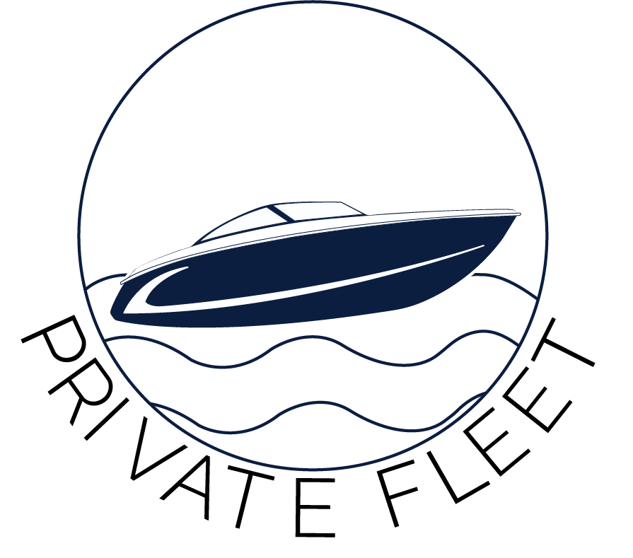

###### Enroll in Private Fleet ©. It's Simple and Secure. A Simple and safe way to offset the costs of boat ownership

- Generates rental income when your boat is not in use
- Turnkey service from boater screening through return inspections
- Full damage & liability coverage by Billy's Power Sports Muskoka fleet insurance
- All renter boat captains are guaranteed BoatSmart certified
- All boats secured by damage deposit
- Complete boat detailing and fuel costs paid by guests

> "The cost of maintaining and storing my 25 foot Cobalt luxury bowrider was really starting to add up so I enrolled in Muskoka District Rental's Private Fleet program. Service is simple,
> safe and completely turn-key and allows me to earn significant rental income when I am not using my boat. I would highly recommend MDR's Private Fleet program any boat owner who is
> looking to offset some of the ongoing costs of boat ownership. Ross H. Port Carling,ON"

###### Watercraft & Equipment for every need & budget

- Lake Cruising Boats ~ Cobalt, Chapparal
- Wakeboard Boats-Mastercraft
- Fishing Boats (with fishfinders)
- PWC/Jetskis
- Pontoon Boats
- Canoes
- Kayaks
- Wakeboards
- SUP boards
- Waterskis
- Water Trampolines

###### For more information or to enroll in Private Fleet © contact us!

Toll-Free: <a href="tel:18006152537">1.800.615.2537</a>

**Team**

Maryrose Coleman ~ Co-Founder, Vice President Client Services
<maryrose@muskokadistrictrentals.com>

Ross Halloran ~ Founder
<ross@muskokadistrictrentals.com>
